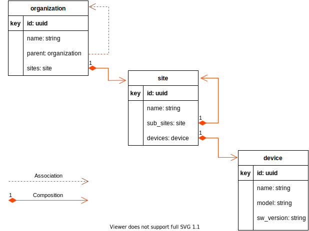



# Introduction

The `createDatabase()` operator creates the database and tables in MySQL to store tree-ware models.

# Meta-Model Aux Data

`MySqlMetaModelAuxPlugin` handles the [`my_sql_` aux data](../user/database-and-tables.md#meta-model-aux-data) in the
meta-model.

# Example Meta-Model

The following meta-model is used as an example in the sections below:



Note that sites can be nested, and devices can be at any level in the site hierarchy.

The following model (based on the above meta-model) is used as an example in the sections below:

```json
{
  "organization": {
    "id": "uuid-1",
    "name": "customer 1",
    "sites": [
      {
        "id": "uuid-1",
        "name": "Site 1",
        "devices": [
          {
            "id": "uuid-1",
            "name": "Device 1"
          },
          {
            "id": "uuid-2",
            "name": "Device 2"
          }
        ],
        "sub_sites": [
          {
            "id": "uuid-2",
            "name": "Site 1.1",
            "devices": [
              {
                "id": "uuid-3",
                "name": "Device 3"
              }
            ],
            "sub_sites": [
              {
                "id": "uuid-3",
                "name": "Site 1.1.1",
                "devices": [
                  {
                    "id": "uuid-4",
                    "name": "Device 4"
                  }
                ]
              }
            ]
          }
        ]
      }
    ]
  }
}
```

# Database

The database name is created by joining the environment name and the meta-model name, separated by a dollar sign.

# Tables

When targeting MySQL, all instances of an entity type are stored in a single table.

The example meta-model has 3 entity types (`organization`, `site`, `device`), so 3 tables will be created for it.

The table name is created as explained [here](../user/database-and-tables.md#meta-model-aux-data).

# Primary Keys

If entity instances are unique only under their parent, then parent paths need to be part of the primary-keys. These
parent paths can be long when the meta-model is deeply nested or when there are recursive entities in the parent path.
These paths contain user data, and recursive entities make the length of these paths unbounded. Therefore, parent paths
cannot be a part of the primary-key when targeting MySQL. Instead, all entities must have system-wide-unique keys when
targeting MySQL. The keys have to be unique only within a specific entity type, not across entity types.

The example meta-model uses UUIDs as keys for entities. A UUID value has to be unique only within a given entity type.
That is why the example model is able to reuse `"uuid-1"` in an organization instance, in a site instance, and in a
device instance (this is for illustration purposes only and reusing UUIDs in different entity types is not recommended).

# Columns

Field names in the meta-model are used as column names. Sometimes column names are derived from multiple fields. In such
cases, the field names are combined with a dollar sign. Tree-ware also adds its own columns and the names for these end
with a dollar sign. Field names in the meta-model are not allowed to have dollar signs, so these column names will not
collide.

The following columns are stored for each entity:

* `created_on$` timestamp column. Tree-ware sets it explicitly in the API layer even though it is marked as
  `NOT NULL DEFAULT CURRENT_TIMESTAMP`. It is set when an entity is created.
* `updated_on$` timestamp column. Tree-ware sets it explicitly in the API layer even though it is marked as
  `NOT NULL DEFAULT CURRENT_TIMESTAMP ON UPDATE CURRENT_TIMESTAMP`. It is set when any changes are made to the entity.
* A text representation of the path to the field composing the entity is stored in a non-indexed `field_path$` TEXT
  column.
* All non-composition fields in the entity are stored in separate columns.
    * For example:
        * the `id`, `name`, and `parent` fields in the `organization` entity
        * the `id`, and `name` fields in the `site` entity
        * the `id`, `name`, `model`, and `sw_version` fields in the `device` entity
* The PRIMARY KEY is made up of only the key field columns.
    * For example, the `id` fields in the `organization`, `site`, and `device` entities
* Association field values are paths with keys of entities along the path. Since tree-ware requires unique-keys while
  targeting MySQL, and since the type of the target entity is fixed in the association meta-model, only the target
  entity's keys need to be stored. The target entity's keys are stored in separate columns. The names for these columns
  are created by joining the association field name and the target entity key field names with a dollar sign. The types
  for these columns is the same as the key columns in the target entity.
    * For example, there is a `parent` association in the `organization` entity, and its target entity is
      the `organization` entity (self-referential). The `id` field is the key field in the `organization` entity. So the
      `parent` association is stored in a column called `parent$id`.
* The columns mentioned above for associations is not sufficient to reconstruct their full paths. So an additional
  column is used for storing the entire path in a TEXT column. The column name is the association field name.
    * The column value is the JSON representation of the association value. In the future, a more compact path
      representation [will be used](https://github.com/tree-ware/tree-ware-kotlin-mysql/issues/76).
    * An alternate to storing the path is to use the other association columns above to look up the target entity and
      use its `field_path$` and keys to build up the association path. While this takes up less storage, it takes up
      more time. So this approach is not the current choice.

# Ancestors

Since the model is a tree, every entity instance in the model tree has a parent (field) path. Tree-ware supports the
ability to list all entities under any ancestor in the parent path. To support this, the key fields of each ancestor are
added as columns in the entity-table. These columns are named by joining the ancestor table names and their key field
names with a dollar sign.

# Recursive Ancestors

Note: [not yet supported](https://github.com/tree-ware/tree-ware-kotlin-mysql/issues/57)

The above approach does not work if the ancestor is a recursive entity. In the case of recursive entities, there can be
many consecutive instances of that entity in the parent path. It is not possible to create columns for each instance
since the number of instances can vary at runtime.

The solution is to use a join-table to store the one-to-many relationship: one entity to many instances of its recursive
ancestors. The join-table is named by joining the entity-table name and the ancestor table name with a dollar sign. The
join-table has the following columns:

* Columns for the key fields of the entity (whose parent path parts are being stored in this join-table).
    * These columns have the same names and types as their counterparts in the main entity-table.
    * Values are the key field values of the entity.
    * These columns are indexed so that rows can be removed (via foreign-key constraints) if the corresponding entity is
      deleted in the entity-table.
* Columns for the key fields in the ancestor entity.
    * These columns have the same names and types as their counterparts in the ancestor entity-table, but they are
      suffixed with a dollar sign in order not to conflict with the columns corresponding to the entity.
    * Values are the key field values of the ancestor.
    * TBR: do these columns need to be indexed by default to speed up the lookup? Non-recursive ancestors are not
      indexed by default, so maybe these should not be indexed by default either?

NOTE: if the immediate parent is a recursive-entity, columns for it are also added to the entity-table as described in
the previous section. This is required in order to restrict the parent from being deleted while it has children.

TODO: will [CTE](https://dev.mysql.com/doc/refman/8.0/en/with.html) be more performant than using a join-table?

# Foreign Key Constraints

* The columns for an association are a foreign key to the target.
    * If the association field is a required field, the foreign key is set to `ON DELETE RESTRICT`.
    * Else it is set to
      `ON DELETE SET NULL` ([not yet supported](https://github.com/tree-ware/tree-ware-kotlin-mysql/issues/54)).
* The columns for the immediate parent are a foreign key to the parent entity-table.
    * To prevent a parent from being deleted if it has children, the foreign key is set to `ON DELETE RESTRICT`.
    * The columns for ancestors are also foreign keys, but they are not declared as foreign keys in order to avoid
      indexes being created automatically for all ancestors.
* The entity columns in the join-table for recursive-entities are foreign keys to the entity in the entity-table.
    * The rows in the join-table need to be removed if the entity in the entity-table is deleted, so the foreign key is
      set to `ON DELETE CASCADE`.

# Indexed Columns

The following columns are always indexed:

* The columns corresponding to key fields (as a result of being in the PRIMARY KEY).
* The `parent$` column.

* Unique indexes for the columns corresponding to the fields in the
  [uniqueness](http://www.tree-ware.org/tree-ware-kotlin-core/user/fields.html#uniqueness) definition in the meta-model.
* Unique indexes for the first keyed parents of an entity without key fields. Entities without keys can only be used in
  1:1 compositions and hence their parent keys have to be unique.
* Columns corresponding to the fields specified in the `indexes` list in `my_sql_` aux data in the meta-model
  ([not yet supported](https://github.com/tree-ware/tree-ware-kotlin-mysql/issues/56)).
* Foreign-key columns (MySQL creates an index automatically if tree-ware does not).

# Validations

* Identifiers/names for the following should not exceed 64 characters:
    * Database
    * Table
    * Column
    * Index
    * [Other identifiers](https://dev.mysql.com/doc/refman/8.0/en/identifier-length.html) as they get used in tree-ware
* Values of the following columns are indexed and should not exceed 3072:
    * Primary key
    * Any other columns that are indexed
* [Other limits](https://dev.mysql.com/doc/refman/8.0/en/innodb-limits.html)